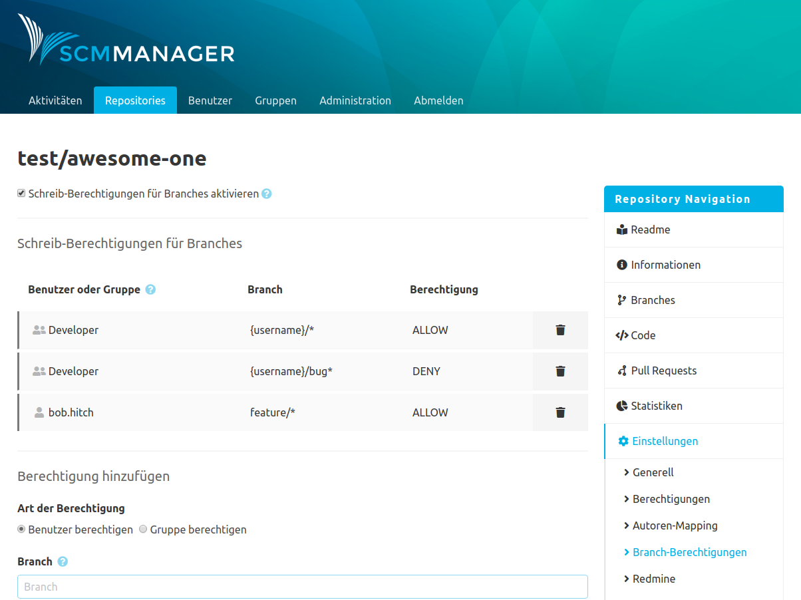

To use the plugin, it has to be activated in the repository's settings by activating the checkbox under "Branch Permissions". Once that is done, write access to the repository is limited based on the defined rules. 

### Add permission
After the branch write permissions were activated, the are "Add permission" appears. There, users and groups can be authorized (or excluded) for branches. The field "Branch" can be used to provide the name of a branch or a pattern. Patterns can be used for user, mail and username.

For example:
* Feature/*
* {mail}/*
* {username}/*
* {mail}
* {username}/*

A DENY rule outweighs an ALLOW rule and can therefor deactivate it. Thanks to that a general allowance can be followed by more specific exclusions.
